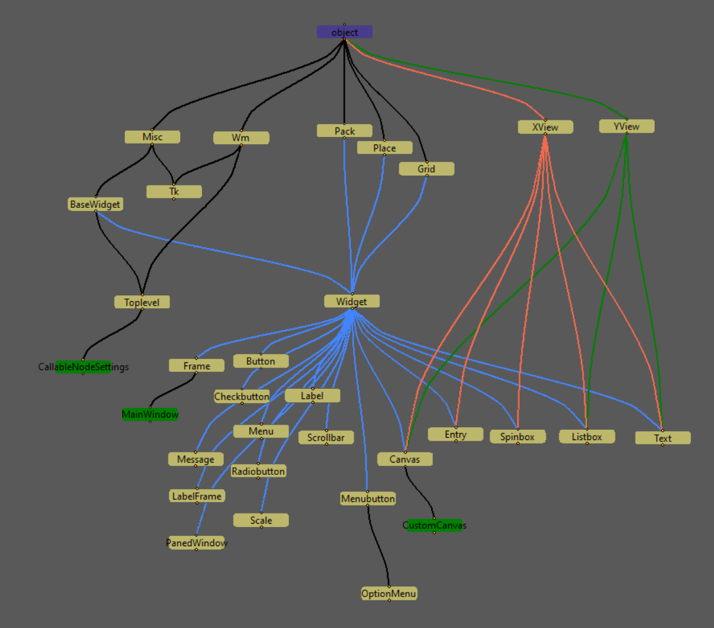
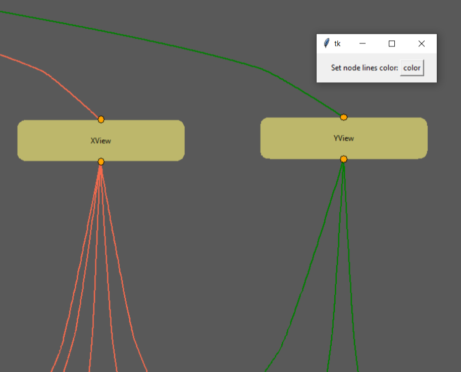

# pyclasstree
## Описание:
**pyclasstree** - модуль для построения схемы дерева наследования классов Python в виде графа с помощью библиотеки tkinter. Данный модуль может быть полезен для более наглядного изображения связей в деревьях наследования классов.

Граф строится на виджете canvas из библиотеки tkinter. Каждый класс изображен в виде прямоугольника с именем класса. Прямоугольник имеет две точки соединения: верхняя точка - для связей с суперклассами, нижняя - для подклассов. Фиолетовым цветом обозначен корневой суперкласс `object`. Красным - метаклассы. Зеленым - подклассы, определенные в данном модуле. Бежевым - все остальные классы. Связи классов представлены в виде линий.



Прямоугольники можно перемещать по холсту при зажатой левой кнопки мыши, при этом все линии связей будут растягиваться вслед за перемещением их точек соединения.

При двойном клике левой кнопкой мыши по прямоугольнику с именем класса, будет открыто всплывающее окно настроек, где можно выбрать особый цвет для линий связей каждого прямоугольника. Это может быть полезно при большом количестве линий связей на холсте.



При зажатой левой кнопке мыши можно прокручивать сам холст. Кроме того, с помощью прокручивания колесика мыши можно изменять зум холста.

## Применение:
Модуль предоставляет только одну основную функцию drawtree, которая в качестве аргумента принимает любой объект класса или экземпляр класса Python.
Чтобы получить результат как на фото выше, достаточно импортировать функцию drawtree и передать в нее любой класс из библиотеки tkinter:

```py
from pyclasstree import drawtree
from tkinter import *


drawtree(Frame)
```

## Детали реализации модуля:
Изогнутые линии связей на холсте рисуются с помощью графика функции арксинуса по точкам, которые вычисляет функция `vertical_graphic_dots`. Эта функция принимает на вход первым аргументом список из четырех координат: x1, y1 для начальной и x2, y2 для конечной точек графика функции. Второй аргумент - количество промежуточных точек на графике функции, которые нужно найти. Функция возвращает список из N координат точек. Чем больше точек. тем более плавной будет выглядеть линия.
Линии могут выглядеть не совсем плавными, когда их слишком много на холсте. Это связано с тем, что для улучшения производительности функция `count_parameters` в классе `MainWindow` определяет количество точек для каждой линии в зависимости от количества линий. Чем больше линий на холсте - тем меньше точек приходится на каждую линию.

Для более понятного отображения прямоугольники каждого класса на холсте располагаются по рядам и столбцам. Номер столбца для каждого класса определяется исходя из количества классов в ряду и присваивается в функции  `count_parameters` в классе `MainWindow`.
Номер ряда вычисляется немного сложнее. Для нахождения более оптимального номера ряда в функции `all_paths` сначала вычисляются длины всех возможных путей на графе от данного класса до корневого класса `object`. Функция `all_paths` рекурсивно проходит по каждому пути и возвращает список с длинами путей. Далее в функции `inspect_class_tree` выбирается самый длинный из возможных путей в списке и присваивается ключу "row" в словаре, который создает данная функция.

### **Примечание:**
Алгоритм определения рядов и столбцов не идеален, поэтому после отображения графа на холсте может потребоваться вручную расположить узлы классов для более удобного просмотра (как это было сделано на скриншотах выше).

Функция `find_all_classes` рекурсивно проходит по дереву наследования классов, используя атрибуты `__bases__` и `__subclasses__()`, и находит все связанные классы.

Функция `inspect_class_tree` проходит по списку классов, которые нашла функция `find_all_classes` и создает словарь `tree_dict`, в котором ключами являются имена классов, а значениями - словари для каждого класса. Эти словари содержат информацию о суперклассах, подклассах и метаклассах, а также модуле, в котором определен класс, и номер ряда класса для расположения на холсте.